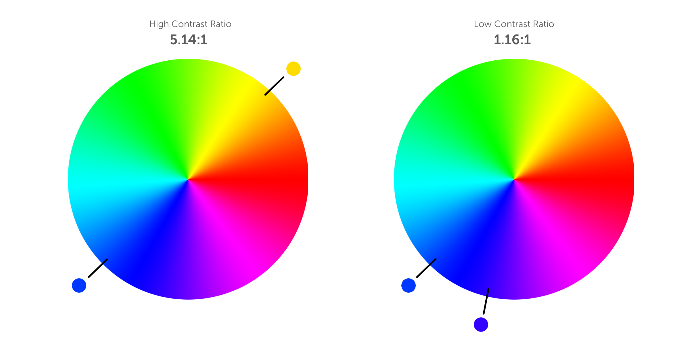

## desIgn 

Everything we see through our eyes has a perceived color that we visualize to understand what it is we are seeing. 
Many of the issues
Most of what I was doing was more learning than doing. It was more from the vantage point of observing others and what they thought was unique.

