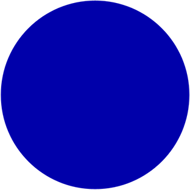

## desIgn 

Everything we see through our eyes has a perceived color that we visualize to understand what it is we are seeing. 
Many of the issues
Most of what I was doing was more learning than doing. It was more from the vantage point of observing others and what they thought was unique.

1. What is Plaid
    - Plaid is a company that helps banks and other financial services companies make it easier for third-party companies to make apps that you can use to do things like check your bank account, pay someone, or get a credit card.

    - It's like the plumbing in your house. Plaid makes sure that the pipes are connected to the right places.

2. What Apps use Plaid
    - Acorns
    - Betterment
    - You Need a Budget
    - Robinhood
    - Upstart
    - Dave
    - Pillar
    - Venmo
    - Coinbase
    - Carvana
    - EllieMae

4. What did Plaid look like to start?
    - It started as a consumer app that helps you manage your money better but then you realized that the banks are the hub for your financial life and that the banks are not as good as they should be at connecting all the apps you use to manage your money so you became a platform that connects all those apps to the bank account.

5. How would a second grader understand Plaid?
    - Plaid is a company that helps other companies get your bank account information. Whenever you give a company your bank account information, Plaid gives them your bank account information.
6. What's an API?
    - API = This is a way for websites to talk to each other. It is like a translator.
7. How can I trust Plaid?
    - Plaid keeps your financial information safe from bad guys.
    it uses encryption to make sure no one can steal your money.
    - Plaid has a special computer system that lets you use your money without ever giving out your username or password.
[Here is a tutorial showing off some of their code!](https://www.loom.com/share/bafe190631a24b739beefc81f863d3b0)